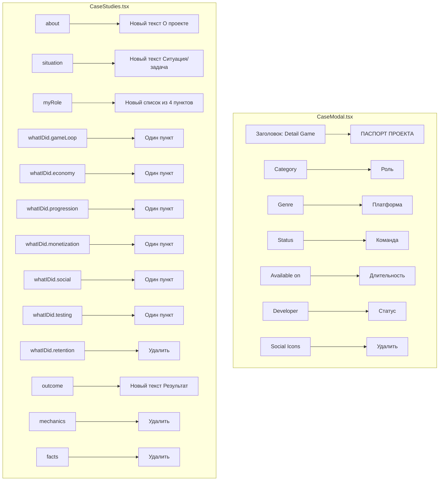

# План правки кейса Miner Kombat

## Обзор

ТЗ требует обновить тексты и подписи в раскрытом кейсе Miner Kombat под портфолио. Изменения затрагивают два файла:
- [`CaseModal.tsx`](src/app/components/CaseModal.tsx) — шаблон модального окна
- [`CaseStudies.tsx`](src/app/components/CaseStudies.tsx) — данные кейса

---

## 1. Изменения в CaseModal.tsx

### 1.1. Заголовок правого инфоблока (строка 139)

```tsx
// Было:
Detail Game

// Станет:
ПАСПОРТ ПРОЕКТА
```

### 1.2. Подписи в правом инфоблоке (строки 147, 153, 159, 165, 173)

| Было | Станет |
|------|--------|
| Category | Роль |
| Genre | Платформа |
| Status | Команда |
| Available on | Длительность |
| Developer | Статус |

### 1.3. Удалить Social Icons (строки 178-192)

Полностью удалить блок с иконками:
```tsx
{/* Social Icons */}
<div className="mt-8 pt-4 flex justify-end gap-6">
  {[...].map((path, i) => (
    ...
  ))}
</div>
```

---

## 2. Изменения в CaseStudies.tsx (кейс Miner Kombat, id: 1)

### 2.1. Подзаголовок (строка 68)

```tsx
// Было:
subtitle: "Продуктовая переработка второй версии: игровой цикл, экономика, прогрессия, монетизация и реферальная система."

// Станет:
subtitle: "Продуктовая переработка второй версии: игровой цикл, экономика, прогрессия, монетизация и реферальная система."
// (текст совпадает, изменений нет)
```

### 2.2. Блок "О проекте" (about, строки 83-84)

```tsx
// Было:
about: "TMA-проект с прогрессией, экономикой и социальными механиками. Первая версия показала органический интерес, но упёрлась в системные ограничения. Моя задача — пересобрать продуктовую основу второй версии с прочным игровым циклом, монетизацией и реферальным контуром."

// Станет:
about: "Miner Kombat — игровой продукт внутри Telegram Mini Apps, построенный вокруг прогрессии, внутриигровой экономики и социальных механик. Первая версия дала ранний органический интерес аудитории, но упёрлась в слабую продуктовую базу: системе не хватало связности, понятной прогрессии и опоры для монетизации."
```

### 2.3. Блок "Ситуация / задача" (situation, строки 85-88)

```tsx
// Было:
situation: "Первая версия дала сильный ранний сигнал, но базовая архитектура не позволяла масштабироваться. Слабая связность систем, недостаточный контур удержания, нет основы для продуктовой проверки решений."
task: "Провести продуктовый пивот: пересобрать игровой цикл, экономику, прогрессию и монетизацию. Собрать живую систему для проверки на реальной аудитории."

// Станет (объединяется в situation):
situation: "Моей задачей было усилить вторую версию продукта и довести её до рабочей релизной формы: собрать более сильный игровой цикл, выстроить экономику, прогрессию, монетизацию и реферальную систему так, чтобы проект можно было проверять на живой аудитории, а не только обсуждать внутри команды."
// task: удалить или оставить пустым
```

### 2.4. Блок "Моя роль" (myRole, строки 89-94)

```tsx
// Было:
myRole: [
  "Ответственность за продуктовую основу второй версии: игровой цикл, экономику и прогрессию",
  "Проектирование монетизационного контура и реферальной системы",
  "Принятие ключевых решений по балансу и системам удержания",
  "Проверка продуктовых гипотез на ограниченном трафике",
]

// Станет:
myRole: [
  "Отвечал за продуктовую логику второй версии: игровой цикл, экономику, прогрессию, награды и возвратные механики.",
  "Участвовал в проектировании монетизации и реферальной системы.",
  "Принимал решения по балансу и удержанию.",
  "Формировал гипотезы и продуктовые проверки на ограниченном трафике.",
]
```

### 2.5. Блок "Что сделал" (whatIDid, строки 95-126)

```tsx
// Было:
whatIDid: {
  gameLoop: [
    "Переработал core loop: добавил возвратные механики и систему наград",
    "Выстроил прогрессию с чёткими точками прогресса и визуальными маркерами",
    "Интегрировал аналитику для отслеживания прохождения и вовлечения",
  ],
  economy: [
    "Спроектировал многовалютную систему с balance sink и source",
    "Выстроил контур внутриигровых покупок и бустеров",
    "Собрал экономическую модель для прогнозирования метрик",
  ],
  monetization: [
    "Разработал магазин с тестированием разных вариантов предложений",
    "Интегрировал IAP и систему платных улучшений",
    "Запустил A/B-тесты по ценообразованию и наполнению офферов",
  ],
  social: [
    "Переработал реферальную систему: привязка не к инвайтам, а к активности приглашённых",
    "Добавил социальные награды за совместный прогресс",
    "Интегрировал таблицы лидеров и клановые механики",
  ],
  retention: [
    "Настроил daily/weekly контур с наградами за возврат",
    "Добавил push-уведомления с триггерами на события в игре",
    "Запустил механики limited-time events для повышения активности",
  ],
  testing: [
    "Сравнивали варианты магазина, наград и вовлекающих механик",
    "Тестировали разные версии реферального контура",
    "Проверяли гипотезы на ограниченном трафике перед масштабированием",
  ],
}

// Станет:
whatIDid: {
  gameLoop: [
    "Переработал базовый игровой цикл и усилил мотивацию к возврату.",
  ],
  economy: [
    "Собрал более рабочую экономику второй версии: валюты, награды, точки расхода и связь экономики с прогрессией.",
  ],
  progression: [
    "Сделал рост игрока более понятным: уровни, новые точки интереса и внятные цели на короткой и средней дистанции.",
  ],
  monetization: [
    "Доработал внутриигровые покупки, бустеры и ускорители прогресса.",
  ],
  social: [
    "Собрал реферальную систему, завязанную не только на приглашение, но и на активность приглашённых игроков.",
  ],
  testing: [
    "Сравнивали варианты магазина, наград, вовлекающих механик и реферальной системы на ограниченном трафике. Это были не декоративные проверки интерфейса, а продуктовые проверки самих систем.",
  ],
}
// retention: удалить блок
```

### 2.6. Блок "Результат" (outcome/facts, строки 127-136)

```tsx
// Было:
outcome: [
  "Проект доведён до рабочей релизной версии и переведён в формат живой проверки на аудитории",
  "Средняя частота сессий: ~5 сессий на игрока в день — сигнал о вовлечённости базового цикла",
  "Вторая версия получила прочную продуктовую основу для масштабирования и дальнейшего развития",
],
mechanics: ["Игровой цикл", "Экономика", "Прогрессия", "Монетизация", "Реферальная система", "Внутренняя валюта", "Тесты гипотез", "Удержание"],
facts: [
  "Проект был доведен до рабочей релизной версии и переведен в формат живой проверки на аудитории. Это позволило получить ранние сигналы по вовлеченности, монетизации и жизнеспособности базового цикла.",
  "Средняя частота доходила примерно до 5 сессий на игрока в день, а сама вторая версия уже стала значительно более пригодной для продуктового развития, чем исходная база первой итерации.",
],

// Станет:
outcome: [
  "За 3 месяца команда из 4 человек довела продукт до рабочей релизной версии.",
  "Вторая версия дала более прочную основу для монетизации, дальнейшего развития и живой проверки продуктовых решений на аудитории.",
  "Проект сейчас заморожен инвестором, но рабочая версия собрана и показывает мой вклад в усиление и доведение живого TMA-продукта.",
],
mechanics: undefined, // удалить блок целиком
facts: undefined, // удалить
```

---

## 3. Глобальная чистка формулировок

Проверить и заменить во всех текстах кейса:

| Было | Станет |
|------|--------|
| реферальный контур | реферальная система |
| контур удержания | система удержания |
| монетизационный контур | монетизация |
| core loop | игровой цикл |
| пересобрать продуктовую основу | усилить вторую версию продукта |

---

## 4. Значения для правого инфоблока

Согласно ТЗ, значения справа должны быть:
- **Роль**: Product Lead / Game Producer
- **Платформа**: Telegram Mini App
- **Команда**: 4 человека
- **Длительность**: 3 месяца
- **Статус**: Проект заморожен инвестором

Текущие значения в данных кейса (строки 78-82):
```tsx
role: "Product Lead / Game Producer",  // ✓ совпадает
platform: "Telegram Mini App",          // ✓ совпадает
stage: "Релизная версия",               // заменить на "4 человека" для поля team?
// Нужно добавить поле duration и team в отображение
```

**Важно**: В CaseModal.tsx поля отображаются в определённом порядке. Нужно убедиться, что данные передаются корректно.

---

## Диаграмма структуры изменений



---

## Порядок выполнения

1. **CaseModal.tsx** — изменения в шаблоне модального окна
2. **CaseStudies.tsx** — обновление данных кейса Miner Kombat
3. **Проверка** — глобальная чистка формулировок

---

## Ожидаемый результат

После правки кейс должен читаться так:
> Я усилил вторую версию живого TMA-продукта, собрал игровой цикл, экономику, прогрессию, монетизацию и реферальную систему, проверял продуктовые гипотезы на ограниченном трафике и довёл проект до рабочей релизной версии.
