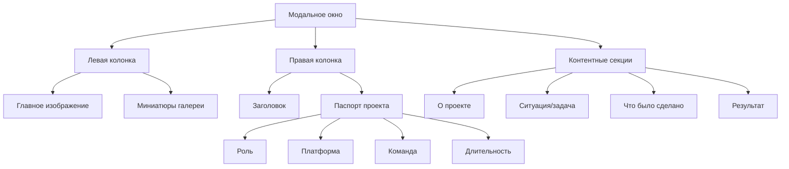

# План обновления кейса Star Riser

## Обзор задачи
Обновить второй кейс в [`CaseStudies.tsx`](src/app/components/CaseStudies.tsx:110) с новым контентом и локальными изображениями.

## Текущее состояние
Кейс Star Riser уже существует в коде (id: 2, строки 110-146), но:
- Использует внешние изображения с Unsplash
- Имеет устаревший контент

## Изменения

### 1. Импорт изображений
Добавить в начало файла (после строки 8):
```typescript
import starRiserImg from "../../assets/SR_main.png";
import srPreview1 from "../../assets/SR_1.jpg";
import srPreview2 from "../../assets/SR_2.png";
import srPreview3 from "../../assets/SR-3.png";
```

### 2. Обновление данных кейса (строки 110-146)

#### Заголовок и тег
- **tag:** `"TMA / LINE"` (без изменений)
- **title:** `"STAR RISER — ПЕРЕСБОРКА CORE-LOOP И ПРОГРЕССИИ"`

#### Правый инфоблок (паспорт проекта)
- **role:** `"продуктовый консультант"`
- **platform:** `"TMA / LINE"`
- **team:** `"6 человек"`
- **duration:** `"2 месяца"`

#### Метрики (metrics)
```typescript
metrics: [
  { icon: <Award size={14} />, value: "продуктовый консультант", label: "Роль" },
  { icon: <Target size={14} />, value: "TMA / LINE", label: "Платформа" },
  { icon: <Clock size={14} />, value: "2 месяца", label: "Срок" },
  { icon: <Users size={14} />, value: "6 человек", label: "Команда" },
],
```

#### О проекте (about)
```
Star Riser — живая 3D TMA-игра с боевым игровым циклом и развитием персонажа. На момент подключения проект уже был в работе и имел активную продуктовую базу, но внутренняя логика развития была собрана неровно: продукту не хватало цельного контура прогрессии, понятных приоритетов роста и устойчивой базы для переноса на новую платформу.
```

#### Ситуация / задача (situation)
```
Проблема была не в одной отдельной механике, а в том, что core-loop, прогрессия и продуктовый контур в целом не давали проекту нормально развиваться дальше. Точечные фиксы здесь не решали задачу. Нужно было провести аудит живого продукта, понять где ломается система, убрать искажение картины из-за некачественного трафика и собрать внятный план развития, который позволит двигать проект дальше и адаптировать его под LINE.
```

#### Что было сделано (actions)
```typescript
actions: [
  "Провёл аудит живой версии продукта и разложил ключевые проблемы по core-loop, прогрессии и удержанию.",
  "Выявил крупный объём некачественного трафика и липовых MAU, чтобы команда не опиралась на ложную картину роста.",
  "Пересобрал продуктовый контур развития: что в системе работает, что требует переработки, а что не даёт проекту масштабироваться.",
  "Сформировал план развития и приоритеты изменений для команды.",
  "Помог адаптировать продуктовую логику под запуск на LINE.",
  "Поддержал перестройку рабочих процессов вокруг развития продукта после аудита.",
],
```

#### Результат (outcome)
```typescript
outcome: [
  "86 место — в топ-100 LINE",
  "2 месяца — срок работы над кейсом",
  "6 человек — команда проекта",
  "2 платформы — TMA и LINE",
  "В результате у команды появилась более честная картина состояния продукта и понятный вектор развития вместо набора разрозненных решений. Проект получил пересобранную основу для движения дальше и был доведён до выхода на LINE.",
],
```

#### Изображения (previewImages)
```typescript
previewImages: [starRiserImg, srPreview1, srPreview2, srPreview3],
```

#### Дополнительные поля
- **subtitle:** `"Пересборка core-loop и прогрессии 3D TMA-игры"`
- **mechanics:** `["Core-loop", "Прогрессия", "Аудит продукта", "Адаптация платформы", "LINE"]`

## Структура кейса в модальном окне



## Файлы для изменения

| Файл | Изменение |
|------|-----------|
| [`src/app/components/CaseStudies.tsx`](src/app/components/CaseStudies.tsx) | Обновить данные кейса id: 2 |

## Доступные изображения в assets

| Файл | Использование |
|------|----------------|
| `SR_main.png` | Главное изображение кейса |
| `SR_1.jpg` | Превью 1 для галереи |
| `SR_2.png` | Превью 2 для галереи |
| `SR-3.png` | Превью 3 для галереи |

## Итоговый комментарий к кейсу

> Этот кейс показывает не "антикризисное спасение", а другое сильное умение: зайти в живой продукт, быстро отделить реальные сигналы от шума, пересобрать контур развития и помочь адаптировать игру под новую платформу без потери продуктовой логики.
